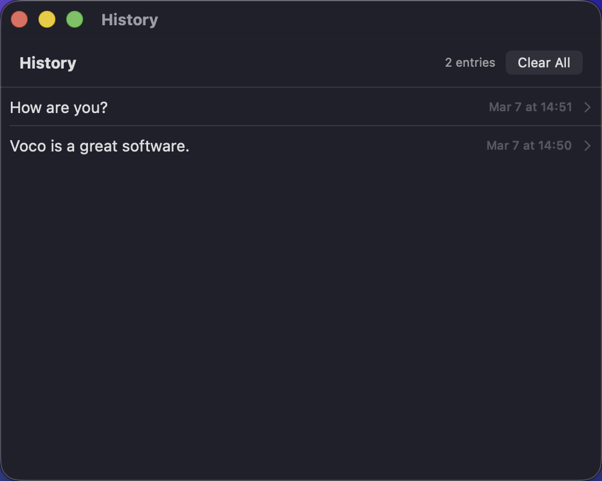

<p align="center">
  
</p>

<h1 align="center">Voco</h1>

<p align="center">
  <strong>Voice input that understands you.</strong><br>
  Speak naturally, get clean text pasted anywhere on your Mac.
</p>

<p align="center">
  
  
  
</p>

---

Voco is a lightweight macOS menu bar app that turns your voice into polished, ready-to-use text. Press a hotkey to start recording, press again to stop — Voco transcribes your speech, cleans it up with an LLM, and pastes the result directly into whatever app you're using.

<p align="center">
  
  &nbsp;&nbsp;&nbsp;
  
</p>

## Features

### Two Modes

- **Transcribe** (`Fn`) — Records your voice, cleans up filler words, fixes grammar, and pastes polished text
- **Translate** (`Shift+Fn`) — Everything above, plus translates from one language to another (e.g. Chinese to English)

Both hotkeys are fully customizable — supports Fn, F1–F12, and any modifier combo.

### Smart Processing

- **Context-aware tones** — Detects the active app (Slack, Mail, Xcode, etc.) and adjusts tone automatically. Choose from formal, casual, technical, neutral, concise, or friendly. Add custom tones for any app by bundle ID.
- **Voice commands** — Say "new line", "period", "question mark", "bullet list", or "第一/第二/第三" and they become real formatting
- **Self-correction handling** — When you rephrase mid-sentence, Voco keeps only the final version
- **Filler word removal** — Strips "um", "uh", "like", "you know", "嗯", "那个", etc.
- **Personal dictionary** — Add custom vocabulary with pronunciation hints and categories (Name, Technical, Brand, Acronym) so names and jargon are always spelled correctly
- **Custom system prompts** — Edit the transcribe and translate prompts in your text editor with live reload. Use placeholders like `{{app_name}}`, `{{tone}}`, and `{{dictionary}}` for dynamic context.

### Designed for macOS

- Lives in the menu bar — always accessible from the top of your screen
- Floating overlay shows recording status with real-time audio level
- Global hotkeys work from any app
- Direct paste via keyboard simulation — text appears right where your cursor is
- Retry last recording if the result wasn't right
- Transcription history with timestamps
- Launch at login support
- Audio feedback sounds for recording start/stop/done/error

### Bring Your Own API

Voco uses cloud APIs with OpenAI-compatible endpoints. STT and LLM are configured independently — different providers, endpoints, models, and API keys for each:

| Component | Default | Alternatives |
|-----------|---------|-------------|
| **Speech-to-Text** | Qwen ASR (DashScope) | Any Whisper-compatible API (OpenAI, Groq, etc.) |
| **LLM** | GPT-4o-mini (OpenAI) | Cerebras, Groq, or any OpenAI-compatible endpoint |

## Installation

### Requirements

- macOS 15 (Sequoia) or later
- Microphone permission
- Accessibility permission (for pasting text into other apps)
- API keys for your chosen STT and LLM providers

### Build from Source

```bash
# Clone the repository
git clone https://github.com/Stanleytowne/Voco.git
cd Voco

# Build (requires Xcode, not just Command Line Tools)
cd Voco
swift build

# Deploy to app bundle
cp .build/debug/Voco .build/Voco.app/Contents/MacOS/

# Launch
open .build/Voco.app
```

> **Note:** The executable must run inside the `.app` bundle. Running the binary directly will exit immediately because the app requires `Info.plist` (with `LSUIElement` for menu bar mode).

## Getting Started

On first launch, Voco walks you through a setup wizard:

<p align="center">
  
</p>

1. **Grant microphone access** — needed to record your voice
2. **Grant accessibility access** — needed to paste text into other apps
3. **Enter STT API key** — for your speech-to-text provider
4. **Enter LLM API key** — for your language model provider
5. **Review hotkeys** — defaults are `Fn` (Transcribe) and `Shift+Fn` (Translate)

## Usage

1. **Focus** the app where you want to type
2. **Press the hotkey** (`Fn` to transcribe, `Shift+Fn` to translate)
3. **Speak** naturally — a floating overlay shows you're recording
4. **Press the hotkey again** (or click the checkmark on the overlay) to stop
5. Your text is **automatically pasted** at the cursor position

Press the **X** button on the overlay or `Esc` to cancel at any time. If the result wasn't right, use **Retry Last Recording** from the menu bar to reprocess the same audio.

## Settings

Access Settings from the menu bar icon (`Cmd+,`).

<p align="center">
  
</p>

### General
Hotkeys, overlay toggle, audio feedback sounds, always-copy-to-clipboard option, launch at login, and permission status.

### Speech (STT)
Configure your speech-to-text provider — base URL, model name, API key, and input language. Defaults to DashScope Qwen ASR.

### AI (LLM)
Configure your language model provider — base URL, model name, and API key. Set translation languages (source and target). Edit the system prompts for both transcribe and translate modes — prompts open in your text editor and auto-reload on save. Includes a "Test Processing" button to verify your LLM connection.

### Tones
Per-app tone profiles that automatically adjust the writing style based on which app is focused. Built-in profiles for common apps (Slack, Mail, Xcode, etc.) can be customized, and you can add new ones by app name and bundle ID.

### Dictionary
Custom vocabulary with pronunciation hints. Add names, technical terms, brands, and acronyms with optional "sounds like" hints so the LLM always spells them correctly. Searchable and categorized.

## History

All transcriptions are saved with timestamps. View them from the menu bar via **History**.

<p align="center">
  
</p>

## How It Works

```
Hotkey pressed → Start recording
    ↓
Hotkey pressed again → Stop recording
    ↓
Audio sent to STT API → Raw transcription
    ↓
Dictionary lookup → Correct custom vocabulary
    ↓
Detect active app → Select tone profile
    ↓
LLM processes text → Clean, formatted output
    ↓
Text pasted at cursor position
    ↓
Saved to history
```

## License

MIT
