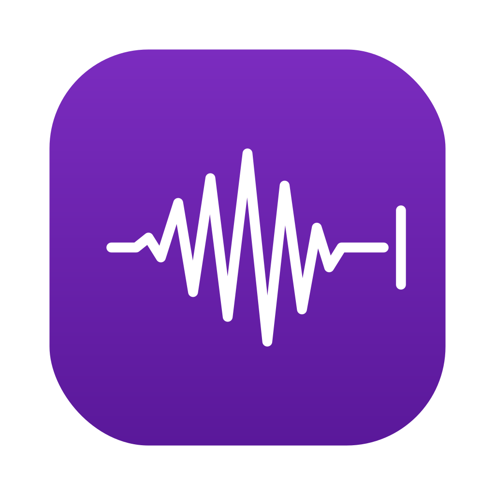
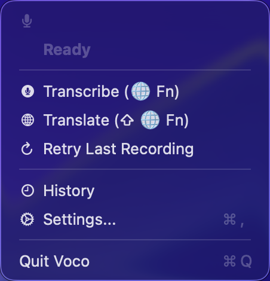
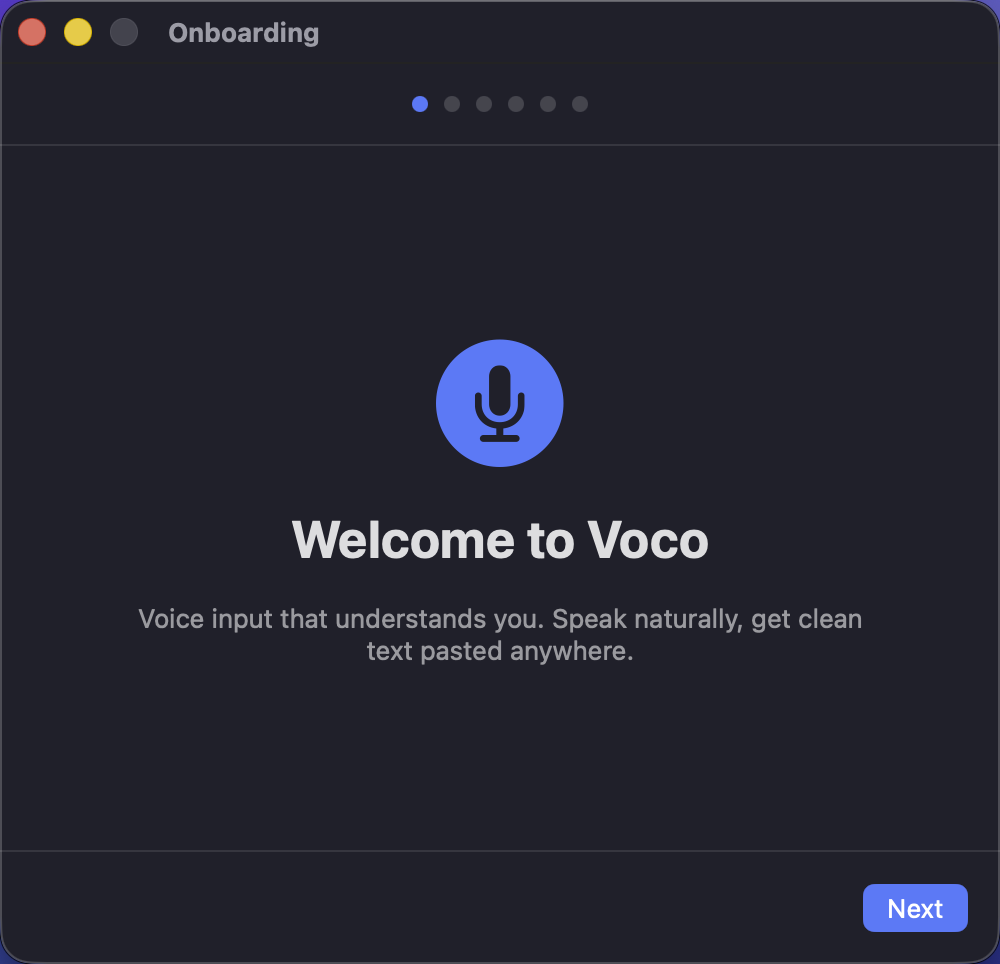
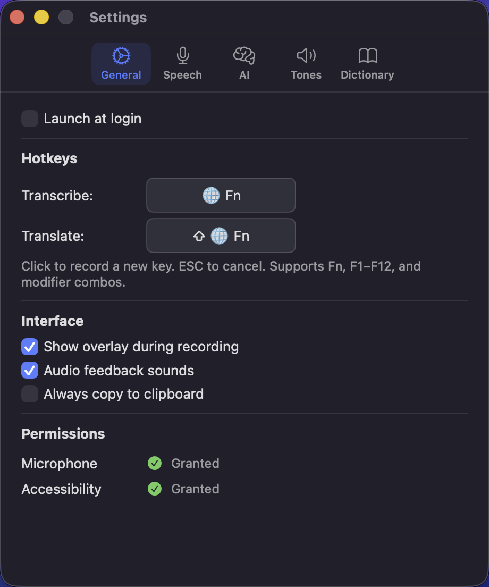

<p align="center">
  
</p>

<h1 align="center">Voco</h1>

<p align="center">
  <strong>Voice input that understands you.</strong><br>
  Speak naturally, get clean text pasted anywhere on your Mac.
</p>

<p align="center">
  
  
  
</p>

---

Voco is a lightweight macOS menu bar app that turns your voice into polished, ready-to-use text. Press a hotkey to start recording, press again to stop — Voco transcribes your speech, cleans it up with an LLM, and pastes the result directly into whatever app you're using.

<!-- TODO: Uncomment when screenshots are added
<p align="center">
  
  &nbsp;&nbsp;
  
</p>
-->

## Features

### Two Modes

- **Transcribe** — Records your voice, cleans up filler words, fixes grammar, and pastes polished text
- **Translate** — Everything above, plus translates from one language to another (e.g. Chinese to English)

### Smart Processing

- **Context-aware** — Detects the active app (Slack, Mail, Xcode, etc.) and adjusts tone automatically
- **Voice commands** — Say "new line", "period", "question mark", or "bullet list" and they become real formatting
- **Self-correction handling** — When you rephrase mid-sentence, Voco keeps only the final version
- **Filler word removal** — Strips "um", "uh", "like", "you know", "嗯", "那个", etc.
- **Personal dictionary** — Add custom vocabulary with pronunciation hints so names and jargon are always spelled correctly

### Designed for macOS

- Lives in the menu bar — no Dock icon, no clutter
- Floating overlay shows recording status with real-time audio level
- Global hotkeys work from any app (default: `F5` for Transcribe, `F6` for Translate)
- Direct paste via keyboard simulation — text appears right where your cursor is
- Launch at login support

### Bring Your Own API

Voco uses cloud APIs with OpenAI-compatible endpoints. You choose the providers:

| Component | Default | Alternatives |
|-----------|---------|-------------|
| **Speech-to-Text** | Qwen ASR (DashScope) | Any Whisper-compatible API |
| **LLM** | GPT-4o-mini (OpenAI) | Cerebras, Groq, any OpenAI-compatible endpoint |

All endpoints, models, and API keys are fully configurable in Settings.

## Installation

### Requirements

- macOS 15 (Sequoia) or later
- Microphone permission
- Accessibility permission (for pasting text into other apps)
- API keys for your chosen STT and LLM providers

### Build from Source

```bash
# Clone the repository
git clone https://github.com/Stanleytowne/Voco.git
cd Voco

# Build (requires Xcode, not just Command Line Tools)
cd Voco
swift build

# Deploy to app bundle
cp .build/debug/Voco .build/Voco.app/Contents/MacOS/

# Launch
open .build/Voco.app
```

> **Note:** The bare executable must run inside the `.app` bundle. Running the binary directly will exit immediately.

## Getting Started

On first launch, Voco walks you through a setup wizard:

1. **Grant microphone access** — needed to record your voice
2. **Grant accessibility access** — needed to paste text into other apps
3. **Enter API keys** — for your STT and LLM providers
4. **Review hotkeys** — default is `F5` (Transcribe) and `F6` (Translate)

<!-- TODO: Uncomment when screenshot is added
<p align="center">
  
</p>
-->

## Usage

1. **Focus** the app where you want to type
2. **Press the hotkey** (`F5` for Transcribe, `F6` for Translate)
3. **Speak** naturally — a floating overlay shows you're recording
4. **Press the hotkey again** (or click the overlay) to stop
5. Your text is **automatically pasted** at the cursor position

Press `Esc` at any time to cancel.

### Settings

Access Settings from the menu bar icon. Configurable options include:

- **General** — Hotkeys, overlay, audio feedback, launch at login
- **STT** — Endpoint URL, model, API key, input language
- **LLM** — Endpoint URL, model, API key, custom prompts
- **Tones** — Per-app tone profiles (e.g. casual for Slack, formal for Mail)
- **Dictionary** — Custom vocabulary with pronunciation hints
- **Translation** — Source and target language selection

<!-- TODO: Uncomment when screenshots are added
<p align="center">
  
</p>
-->

## How It Works

```
Hotkey pressed → Start recording
    ↓
Hotkey pressed again → Stop recording
    ↓
Audio sent to STT API → Raw transcription
    ↓
Dictionary lookup → Correct custom vocabulary
    ↓
Detect active app → Select tone profile
    ↓
LLM processes text → Clean, formatted output
    ↓
Text pasted at cursor position
```

## Screenshots

> Screenshots will be added here. Placeholder locations for:
>
> - `assets/screenshot-menubar.png` — Menu bar dropdown
> - `assets/screenshot-overlay.png` — Recording overlay
> - `assets/screenshot-settings.png` — Settings window
> - `assets/screenshot-onboarding.png` — Onboarding wizard
> - `assets/screenshot-history.png` — Transcription history

## License

MIT
